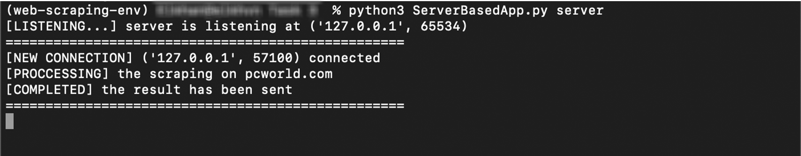
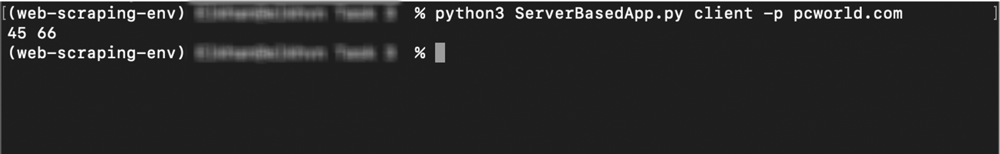

# Server Based App
Simple scraping application created by python [socket](https://docs.python.org/3/library/socket.html) and [beautifulsoup4](https://pypi.org/project/beautifulsoup4/) modules.

Server terminal window


Client terminal window

## Table of contents
* [Description](#description)
* [Perequisites](#perequisites)
* [Installation](#installation)
* [Usage](#usage)
    * [Server](#server)
    * [Client](#client)

## Description
Console-based app with two roles server and the client. The server must be started and wait the request from the client. 
- Server must produce the web scraping of the webpage to get two parameters: the number of pictures and the number of the leaf paragraphs. The leaf paragraphs in HTML document represents only the last paragraphs in the nested paragraph structures. 

- The client sends the request to the server to get the proper answer. The client has options page (- p) to get the statistical data. All the cacluation is done on the server side.

> Server is possible to carry out several clients conccurently without delays because of [threading](https://docs.python.org/3/library/threading.html) module used to accept connections

## Perequisites 
* Python 3
* Access to the internet


## Installation

To download this repository you should use `git clone` command in your terminal.

```bash
git clone https://github.com/Khaaaan/Server-Based-App.git
```

After downloading this repository, to install requirements to launch this application you can use `pip install` command in repository directory.

```bash
pip install requirements.txt
```
## Usage
You can run this application as server or client.

```bash
usage: ServerBasedApp.py [-h] {server,client} ...

Send url and get the number of leaf paragraphs and images

positional arguments:
{server,client}
    server         activate the server
    client         activate the client

optional arguments:
-h, --help       show this help message and exit
```
### Server
To receive url and process webpage and finally send back all gathered information, server should be always running at the background. To run apllication as ***server*** enter this in command line
```bash
python3 ServerBasedApp.py server
```
### Client
In case of client, you should also add URL of the target webpage to the path. 
> URL could be either with our without  **http(s)://**   protocol

```bash
usage: ServerBasedApp.py client [-h] -p P

optional arguments:
  -h, --help  show this help message and exit
  -p P        Domain which you want get information from
```

To run this application in the client mode you should write  in terminal:
```bash
python3 ServerBasedApp.py client -p domain
```
